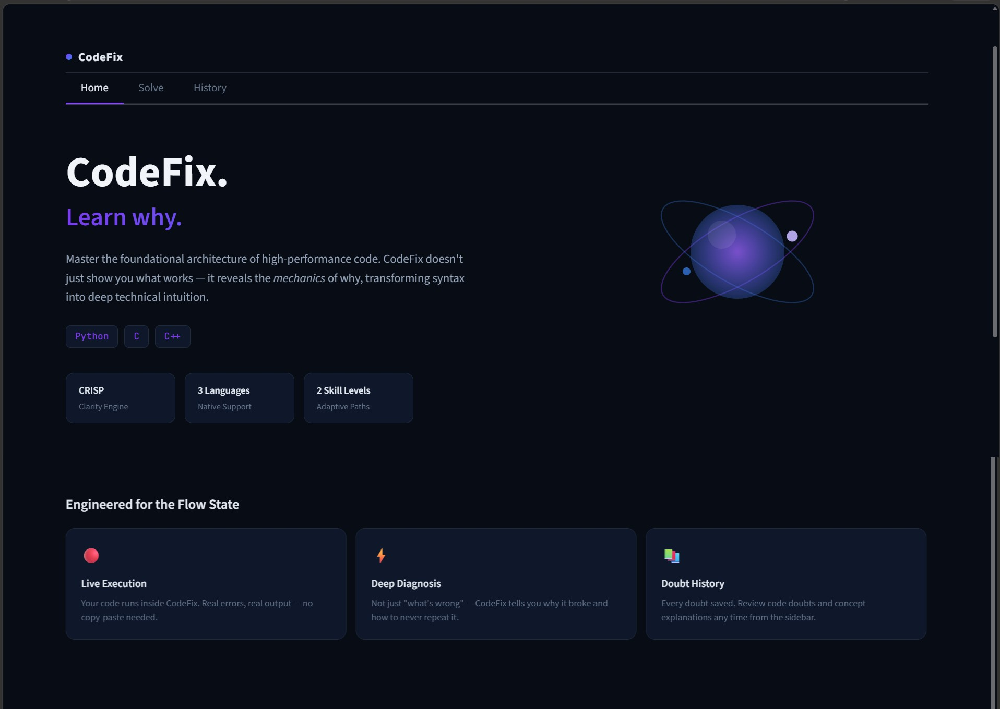
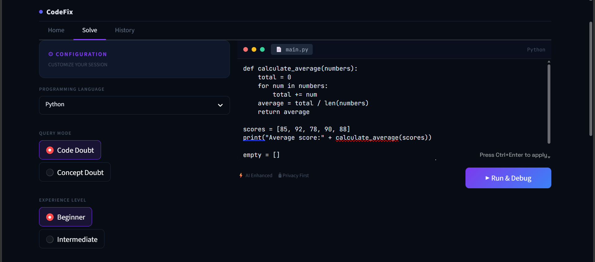
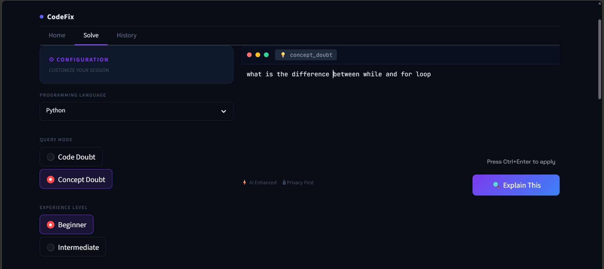
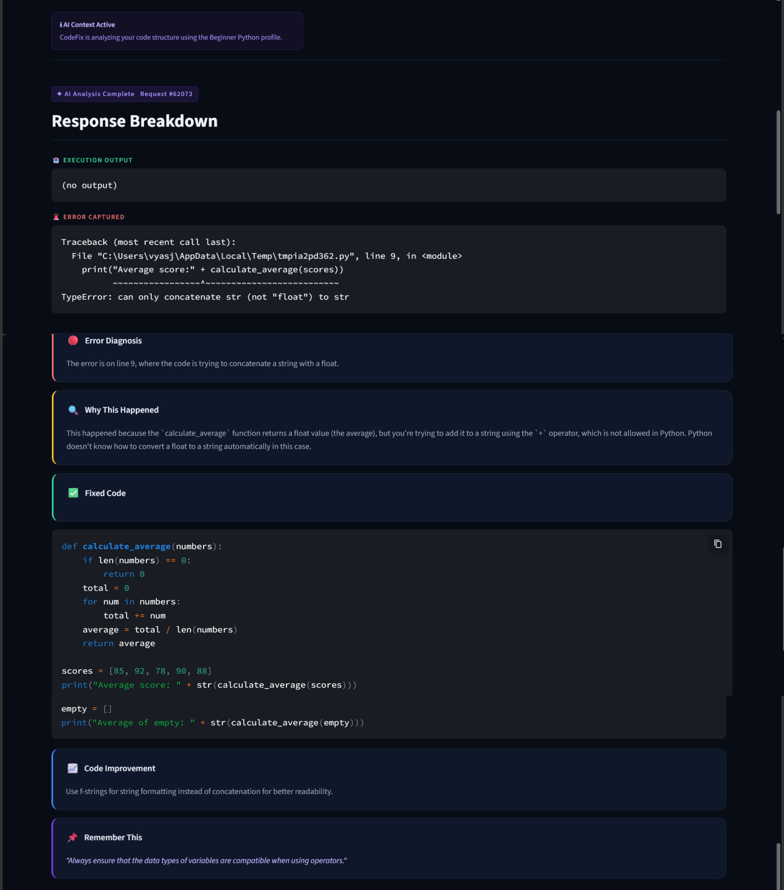
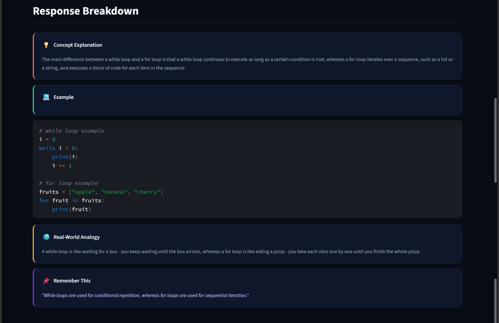
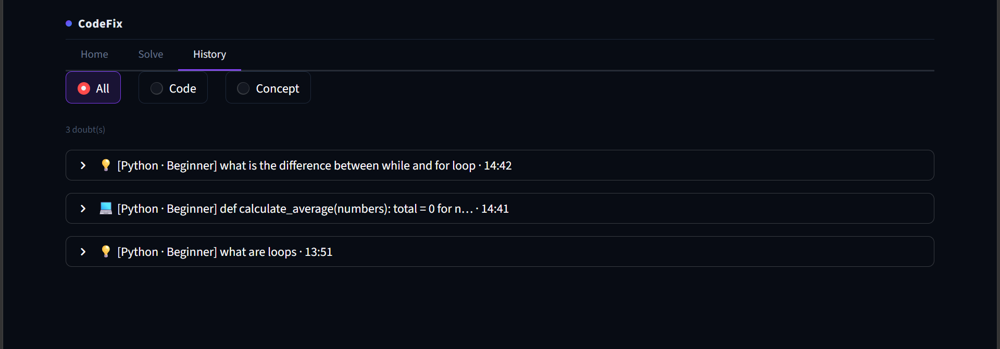

<div align="center">


<br/><br/>

# 🧠 CodeFix
### *Learn why. Not just what.*

**An AI-powered coding tutor that runs your code, catches the error, and teaches you why it broke — so you never repeat it.**

<br/>

*Built by Team **SheCoders** for Academic Titans Hackathon · Problem Statement AT-01-S4*

</div>

---

## 📌 Product Overview

CodeFix is an AI-based student doubt-solving chatbot built specifically for **1st and 2nd year engineering students** learning Python, C, and C++.

Most debuggers tell you *what* broke. Stack Overflow tells you *what* to paste. **CodeFix tells you *why* it broke** — and makes sure you understand it well enough to never repeat the mistake.

### What makes CodeFix different

| Feature | Traditional Approach | CodeFix |
|---|---|---|
| Error diagnosis | Student pastes error manually | App **runs the code automatically**, captures real error |
| Explanation | Stack Overflow answer | Structured 5-section AI breakdown |
| Learning | Fix and forget | **Remember This** tip to retain the lesson |
| Concept doubts | Google search | Deep Dive with analogy + working example |
| History | Nothing saved | Full session history in **History tab** |

### 🌍 UN SDG Alignment

> **SDG 4 — Quality Education**: CodeFix directly addresses the gap in accessible, personalized programming education for undergraduate students. By making AI-powered tutoring available to any student with a browser, it democratizes the kind of one-on-one mentorship that most students never get.

---

## 🚀 Installation Guide

### Prerequisites

Make sure you have the following installed:

```bash
Python 3.8+
pip
streamlit
requests
```

For **C / C++** execution support:
- **Windows**: Install [MinGW](https://www.mingw-w64.org/) and add to PATH
- **Linux/Mac**: `sudo apt install build-essential` or `xcode-select --install`

### Step-by-step Setup

**1. Clone the repository**
```bash
git clone https://github.com/aasthavyas0023-web/codefix.git
cd codefix
```

**2. Install dependencies**
```bash
pip install streamlit requests
```

**3. Add your Groq API key**

Open `app_1_1_5.py` and replace the placeholder on line ~387:
```python
GROK_API_KEY = "gsk_your_actual_key_here"
```
Get your free key at [console.groq.com](https://console.groq.com)

**4. Run the app**
```bash
streamlit run app_1_1_5.py
```

**5. Open in browser**
```
Local URL:   http://localhost:8501
```

---

## 🏗️ Visual Architecture

> Open `docs/architecture_diagram.html` in a browser for the full interactive version, or screenshot it for this README.


The architecture flows through **5 layers**:

| Layer | Component | Role |
|---|---|---|
| 01 · User | Student | Pastes code or types concept doubt |
| 02 · Frontend | Streamlit · 3 Tabs | Home, Solve (always-visible input + response), History |
| 03 · Execution | subprocess.run() | Runs code in isolated child process, captures stdout + stderr |
| 03 · Prompt | CRISP Framework | Structures prompt with Context, Role, Instructions, Specifics, Parameters |
| 04 · AI | Groq API · llama-3.3-70b | Generates structured response with retry logic on rate limits |
| 05 · Output | 5 Response Cards | Error Diagnosis → Why Happened → Fixed Code → Improvement → Remember This |

**Session state** loops back from the response cards to the History tab — every doubt is auto-saved without the student doing anything.

### Tech Stack

```
Frontend       →  Streamlit (Python)
AI Engine      →  Groq API (llama-3.3-70b-versatile)
Prompt Method  →  CRISP Framework (Context, Role, Instructions, Specifics, Parameters)
Code Execution →  Python subprocess module
Languages      →  Python 3, C (gcc), C++ (g++)
```

---

## 🖥️ Final Gallery













## 📁 Repository Structure

```
codefix/
├── src/
│   └── app_1_1_5.py          # Main application (latest version)
├── assets/
│   └── screenshots/          # UI screenshots for README
├── docs/
│   ├── SheCoders_W4_C2.png   # Shark Tank pitch poster
│   └── SheCoders_W4_C3.pdf   # SDLC engineering report
├── README.md                 # This file
└── requirements.txt          # Python dependencies
```

---

## 📦 requirements.txt

```
streamlit>=1.32.0
requests>=2.31.0
```

---

## 👩‍💻 Team — SheCoders

| Name | Role | GitHub |
|---|---|---|
| **Aastha Vyas** | Lead Developer · UI · AI Integration | [@aasthavyas0023-web](https://github.com/aasthavyas0023-web) |
| **Amreen Fatima** | Documentation · Testing | — |
| **Nabila Tahoor** | Research · Prompt Design | — |

*Stanley College of Engineering and Technology for Women, Hyderabad*

---

## 🏆 Hackathon Details

| Field | Detail |
|---|---|
| Hackathon | Academic Titans |
| Problem Statement | AT-01-S4 — AI-Based Student Doubt Solving Chatbot |
| Team | SheCoders |
| Week | 4 (Final) |
| Submission Date | Friday, May 30 2026 |

---

<div align="center">

**CodeFix** · Built with ❤️ by SheCoders · Academic Titans 2026

*"Stack Overflow tells you what to paste. CodeFix tells you why it broke."*

</div>